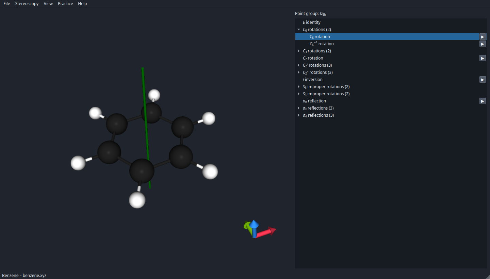
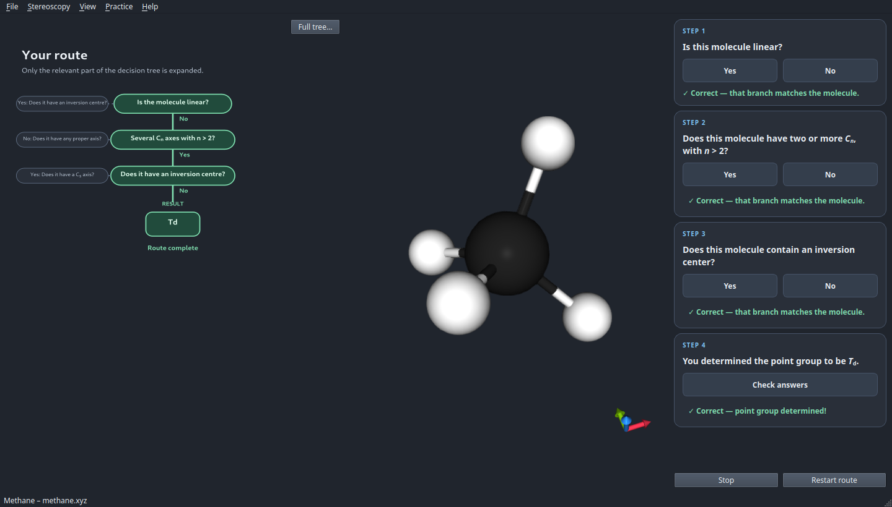
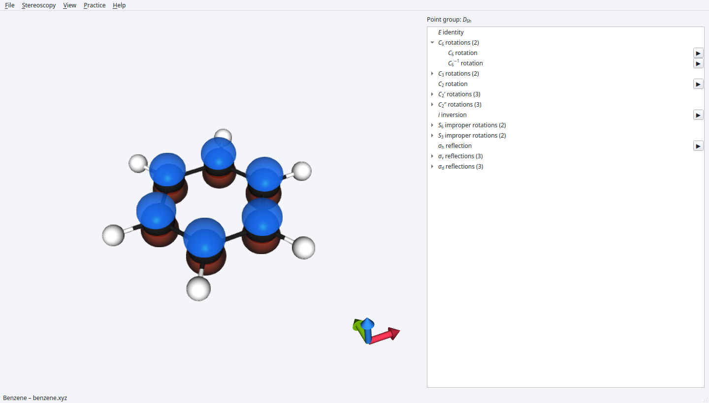

# Schoenflies

/ˈʃøːnfliːs/

Determine and visualise molecular symmetry.

Versions ≤ 1.1: [original implementation](https://gitlab.com/lkkmpn/schoenflies) by Luuk Kempen (2021)  
Versions ≥ 1.2: maintained as a port by Ivo Filot

## Download

[Download the latest Windows installer](https://github.com/ifilot/schoenflies/releases/latest/download/Schoenflies-Windows-Setup.exe)

[Download the latest macOS installer (Apple Silicon)](https://github.com/ifilot/schoenflies/releases/latest/download/Schoenflies-macOS-arm64.dmg)

## Screenshots

Explore benzene's D₆ₕ symmetry and select a symmetry operation to display its axis
or plane in the molecular viewer.



Follow the guided decision tree to determine a molecule's point group, with
feedback on each answer. This completed methane exercise identifies T<sub>d</sub> symmetry.



Visualise atomic orbital basis functions with distinct colours for their positive
and negative phases. Here, carbon 2p orbitals are displayed on benzene in the light theme.



## Appearance

Open **View → Settings…** to choose the dark or light theme (on macOS, Settings
appears in the application menu). Changes apply immediately without restarting
the molecule or exercise. The selected theme is saved automatically for future
sessions; dark is the default.

## Compilation

### Ubuntu / Debian

Install the required packages

```bash
sudo apt install build-essential cmake qt6-base-dev qt6-base-dev-tools qt6-svg-dev libqt6opengl6-dev libboost-all-dev libeigen3-dev libfreetype-dev libglm-dev nlohmann-json3-dev
```

and then compile using

```
cd build
cmake ..
make -j
```

and test via

```bash
make test
```

### Windows / MSYS2 MinGW64

Install the required packages

```bash
pacman -S --needed \
  mingw-w64-x86_64-gcc \
  mingw-w64-x86_64-cmake \
  mingw-w64-x86_64-make \
  mingw-w64-x86_64-qt6-base \
  mingw-w64-x86_64-qt6-tools \
  mingw-w64-x86_64-qt6-svg \
  mingw-w64-x86_64-boost \
  mingw-w64-x86_64-eigen3 \
  mingw-w64-x86_64-glm \
  mingw-w64-x86_64-freetype \
  mingw-w64-x86_64-nlohmann-json \
  mingw-w64-x86_64-mesa \
  mingw-w64-x86_64-ninja
```

and then compile using

```bash
cd build
cmake ..
make -j
```

and test via

```bash
cmake --build . --target test
```

## Funding

Development of this project is partially funded by
[the BOOST! program of Eindhoven University of Technology.](https://boost.tue.nl)
